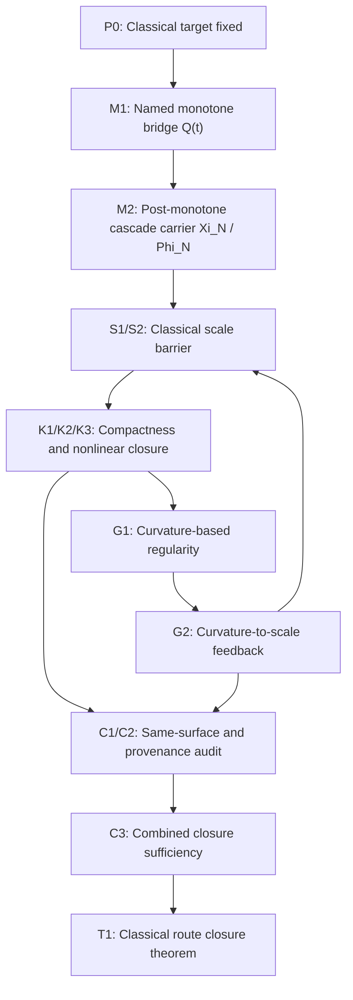

# Navier-Stokes Main Theorem Draft

## Purpose

This document is the theorem-integration surface for the live Navier-Stokes lane. It takes the current theorem target, the bridge packages, and the currently open obligations in `proof-assembly.yaml` and arranges them into one explicit dependency chain for the classical Euclidean equation. It is not a release manuscript. Its job is to say exactly what must be proved, in what order, and where each remaining burden enters the main theorem.

## Classical Theorem Target

Let `u` be a classical solution of the three-dimensional incompressible Navier-Stokes equations on `[0,T) x R^3` arising from smooth compactly supported divergence-free initial data `u_0`. The theorem target is a no-blow-up result for this equation itself.

The route is invalid if any theorem-critical step depends essentially on:

- a regularized, filtered, truncated, or hyper-viscous evolution law;
- a geometric carrier not pulled back to the Euclidean equation;
- a hidden strengthening of the admissible data class;
- a heuristic frequency-decay slogan standing in for a proved estimate.

## Honest Main Theorem Posture

### Theorem T1. Classical route closure

On the classical three-dimensional incompressible Navier-Stokes equation on `[0,T) x R^3`, arising from smooth compactly supported divergence-free initial data in the lane’s admissible class, the cascade/compactness/gradient singularity pathway does not occur on `[0,T)`.

### Current status

- `Theorem status`: conditional on the primary full-claim surface
- `Open frontier count`: 3
- `Blocking bridge families`: curvature-first fourth bridge, final theorem warrant, and one remaining paper-legibility explanation for the named monotone bridge
- `Unconditional Clay-claim posture`: not yet supported

## Package-Level Dependency Graph

## Proposition Sequence

### P0. Classical target discipline

All theorem-bearing work is carried out on the Euclidean three-dimensional incompressible Navier-Stokes equation itself. Modified equations, filtered flows, geometric reformulations, and regularized branches are diagnostic only unless they are pulled back to the same PDE surface with no extra coercive structure.

- Status: grounded
- Role: fixes the theorem surface before any bridge package is allowed to contribute

### P1. Coarse control is necessary but not sufficient

Global energy or enstrophy control is necessary for any regularity argument, but by itself it does not rule out concentration at arbitrarily small scales.

- Status: grounded
- Role: explains why the route must pass through scale barrier, compactness, and gradient control rather than stopping at coarse bounds

### S1. Classical dangerous-scale barrier

There exists a classical dyadic tail bound or equivalent flux estimate on the original equation that suppresses persistent high-frequency transfer strongly enough to block the live dangerous-scale cascade.

- Status: discharged on the classical surface
- Bridge package: `scale-barrier-package.md`
- Closing object: `scale_cubic_tail_absorption_lemma`
- Current posture: the genuine high-high transport packet is reduced to a cubic dyadic tail and absorbed on the classical energy surface for all large cutoffs.

### S2. Dangerous-scale strength interface

The scale-barrier bound from `S1` is quantitatively strong enough to feed both the compactness upgrade and the Euclidean gradient mechanism at the exact theorem level later required.

- Status: discharged downstream of `S1`
- Bridge package: `scale-barrier-package.md`
- Current posture: the interface object is explicit in `classical-scale-barrier-functional.md`; the upstream `S1` burden is already discharged, so this strength interface is fully available downstream.

### K1. Classical approximation carrier

There exists a classical approximation family `u^(n)` with associated pressures `p^(n)` on the same admissibility surface as the target theorem, and the approximation device does not import theorem-critical smoothing that is absent from the original PDE.

- Status: fixed downstream package
- Bridge package: `compactness-package.md`
- Role: fixes the carrier on which the compactness and nonlinear limit steps are proved

### K2. Compactness upgrade

Assume `S1` and `S2`. Then the classical approximation carrier from `K1` enjoys a local strong compactness upgrade beyond weak control, in the exact spacetime topology needed for the nonlinear term.

- Status: discharged downstream of `S1`
- Bridge package: `compactness-package.md`
- Current posture: no longer an independent frontier; the package is written on one fixed classical scheme and waits only on the upstream scale input.

### K3. Quadratic nonlinear closure

Under the convergence produced by `K2`, the tensor products `u^(n) tensor u^(n)` converge to `u tensor u` in the exact sense needed to pass the quadratic term on the classical equation.

- Status: discharged downstream of `S1`
- Bridge package: `compactness-package.md`
- Current posture: no longer an independent frontier once the scale input is supplied on the fixed scheme.

### G1. Curvature-based regularity

The original source family uses curvature-based regularity as the fourth theorem-bearing principle.

- Status: primary fourth-bridge branch selected, not yet fully promoted
- Bridge package: `gradient-package.md`
- Current posture: the source-faithful branch is explicit through `curvature-based-regularity-discharge-source-pack.md`.

### G2. Curvature-to-scale feedback

Assume the source-faithful curvature-based bridge from `G1`. Then bounded gradient control feeds back into the scale-barrier side of the original four-way loop by damping the nonlinear gradient-growth channel that would otherwise reopen the cascade.

- Status: locally explicit, not yet promoted into the final theorem warrant
- Bridge package: `gradient-package.md`
- Closing object: `curvature-to-scale-feedback-bridge`
- Current posture: the feedback arrow is explicit in the source stack and now exact in the lane, but it is still not fully integrated into the final warrant.

### C1. Same-surface admissibility audit

The propositions `S1`, `S2`, `K1`, `K2`, `K3`, `G1`, and `G2` all live on one admissible theorem surface: same equation, same data class, same viscosity regime, same pressure law, and no hidden strengthening of hypotheses.

- Status: open safeguard
- Bridge package: `closure-package.md`
- Role: prevents package drift across incompatible theorem surfaces

### C2. No-hidden-modified-equation and no-stronger-hypotheses safeguard

No theorem-critical step in `S1` through `G2` depends essentially on regularization, filtering, truncation as altered dynamics, geometric curvature, or a stronger hidden admissibility class.

- Status: discharged safeguard
- Bridge package: `closure-package.md`
- Current posture: the theorem-level audit remains open until the curvature-first fourth bridge is carried through the same warrant as the earlier packages.

### C3. Combined closure sufficiency

Assume `S1`, `S2`, `K1`, `K2`, `K3`, `G1`, `G2`, `C1`, and `C2`. Then the live cascade/compactness/gradient singularity route is fully blocked on the classical equation.

- Status: open
- Bridge package: `closure-package.md`
- Closing object: `combined_closure_sufficiency_lemma`
- Current posture: this is now the exact final integration target, not a discharged theorem.

## Open Obligation Map

| Open obligation | Integration slot | Current posture |
| --- | --- | --- |
| Explain why the monotone bridge is a named source-level theorem object rather than generic background energy | paper-legibility / route explanation | dedicated explanation surface added; runner has not yet rebuilt the matrix off it |
| gradient-control bridge discharge | fourth-bridge slot | curvature-first route selected and explicit; exact remaining burden is the pullback target in `curvature-to-euclidean-pullback-target.md` |
| Theorem 2.1 (Classical Closure) | final theorem warrant | still conditional until the curvature-first fourth bridge is integrated through C1/C2/C3; the exact warrant carrier is now localized in `classical-closure-warrant-carrier.md` |

## Proof Roadmap

### Stage 1. Fix the classical carrier

Use `P0`, `P1`, and `K1` to lock the PDE surface, admissible data class, and approximation carrier. No later proposition may silently change these inputs.

### Stage 2. Prove the scale barrier

Import `S1` as discharged. This is still the first decisive bridge because both compactness and gradient control depend on it, but the live work on that front is now complete: the strict low-mode scale pieces and spill term are localized, the genuine high-high packet reduces to a cubic dyadic tail, and that tail is absorbed on the classical energy surface.

### Stage 3. Upgrade compactness and close the nonlinear term

With `S1` available, import the already-written fixed-scheme compactness package (`K1`-`K3`). These steps are no longer the live bottleneck; they remain downstream consumers of the scale input.

### Stage 4. Carry the source-faithful fourth bridge

Use `G1` and `G2` to carry the original curvature-based fourth bridge and its feedback arrow through the same theorem surface as the earlier packages. This stage is not complete yet: the loop-closing fourth bridge is explicit, but not yet fully promoted into the final warrant.

If the lane later elects to supersede the curvature branch by a Euclidean
same-surface upgrade, the admissible theorem shapes are the four frontier
schemas recorded in
[regularity-upgrade-schemas.md](/Users/thomasbirnie/Documents/Research-Consolidation/problems/navier-stokes/theorem-construction/regularity-upgrade-schemas.md).
Those schemas do not count as discharge by themselves. They only define the
exact kind of theorem that would be needed to close the BKM/gradient frontier
on the classical equation.

The strongest currently available internal alternative is now explicit in
[carrier-coherence-defect-to-low-mode-strain-suppression.md](/Users/thomasbirnie/Documents/Research-Consolidation/problems/navier-stokes/theorem-construction/carrier-coherence-defect-to-low-mode-strain-suppression.md).
That route does not ask the classical equation to generate low-mode strain
suppression from scratch. It asks for a theorem-grade export of the carrier
coherence defect and spectral-gap leakage control to the classical low-frequency
band. Until that export theorem is proved, the ontic route remains a stronger
architecture, not yet a certified classical discharge.

### Stage 5. Audit admissibility and provenance

Prove `C1` and `C2`. These are not cosmetic. They certify that the earlier package results all belong to one theorem and that no hidden modified-equation work is carrying the proof.

### Stage 6. Close the route

With `S1`, `M1`, `M2`, `K1`-`K3`, and the curvature-first `G1`/`G2` packages all promoted on one theorem surface, `C3` can promote `T1` from a route theorem to a genuine no-blow-up theorem for the stated solution class.

## Immediate Paper-Section Conversion

When the bridge packages return in theorem-bearing form, this document should convert almost directly into the paper body in the following order:

1. setup and admissible theorem surface;
2. dangerous-scale barrier section (`S1`, `S2`);
3. compactness and nonlinear closure section (`K1`, `K2`, `K3`);
4. curvature-based fourth-bridge section (`G1`, `G2`);
5. admissibility/provenance audit section (`C1`, `C2`);
6. main theorem closure section (`C3`, `T1`).

## Honest Final Posture

The route is now integrated well enough that the final theorem architecture is explicit and local on the primary full-claim surface. The remaining work in the lane is still theorem closure: promote the curvature-first fourth bridge through the final warrant, then rebuild the manuscript and release surfaces off that honest closure.
