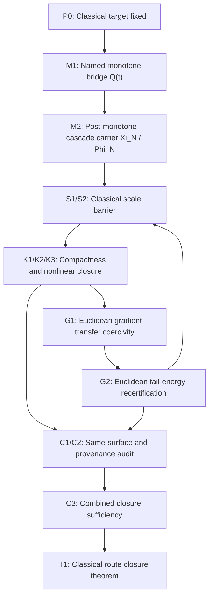

# Navier-Stokes Main Theorem Draft

## Purpose

This document is the theorem-integration surface for the live Navier-Stokes
lane. It takes the current theorem target and the bridge packages and records
the explicit dependency chain for the classical Euclidean equation. It is not a
release manuscript. Its job is to state the exact closure architecture, show
how each bridge enters that architecture, and keep manuscript or export
maintenance separate from theorem-grade proof discharge.

## Classical Theorem Target

The theorem target is the official Clay Navier-Stokes problem in dimension `3`.
The active branch in this lane is the whole-space existence-and-smoothness statement:

For every smooth divergence-free rapidly decaying initial datum `u^0` on `R^3`, with `f = 0`, there exist `u,p in C^\infty(R^3 x [0,\infty))` solving the three-dimensional incompressible Navier-Stokes equations and satisfying `int_{R^3} |u(x,t)|^2 dx < C` for all `t >= 0`.

The route is invalid if any theorem-critical step depends essentially on:

- a regularized, filtered, truncated, or hyper-viscous evolution law;
- a geometric carrier not pulled back to the Euclidean equation;
- a hidden strengthening of the admissible data class;
- an unproved frequency-decay slogan standing in for a proved estimate.

## Honest Main Theorem Posture

### Theorem T1. Classical route closure architecture

For every smooth divergence-free rapidly decaying initial datum `u^0` on `R^3`, with `f = 0`, there exist `u,p in C^\infty(R^3 x [0,\infty))` solving the three-dimensional incompressible Navier-Stokes equations and satisfying `int_{R^3} |u(x,t)|^2 dx < C` for all `t >= 0`.

### Current status

- `Theorem-local status`: the four bridge packages and the Euclidean `C3`
  closure packet are explicit on one fixed surface, but decisive packet
  reductions remain compressed
- `Open math frontier count`: 5
- `Non-theorem maintenance`: packet / review / export synchronization, plus
  manuscript-level expansion of the proof-critical reductions

## Package-Level Dependency Graph

## Proposition Sequence

### P0. Classical target discipline

All theorem-bearing work is carried out on the Euclidean three-dimensional incompressible Navier-Stokes equation itself. Modified equations, filtered flows, geometric reformulations, and regularized branches are diagnostic only unless they are pulled back to the same PDE surface with no extra coercive structure.

- Status: grounded
- Role: fixes the theorem surface before any bridge package is allowed to contribute

### P1. Coarse control is necessary but not sufficient

Global energy or enstrophy control is necessary for any regularity argument, but by itself it does not rule out concentration at arbitrarily small scales.

- Status: grounded
- Role: explains why the route must pass through scale barrier, compactness, and gradient control rather than stopping at coarse bounds

### S1. Classical dangerous-scale barrier

There exists a classical dyadic tail bound or equivalent flux estimate on the original equation that suppresses persistent high-frequency transfer strongly enough to block the live dangerous-scale cascade.

- Status: compressed-critical on the classical surface
- Bridge package: `scale-barrier-package.md`
- Closing object: `scale_cubic_tail_absorption_lemma`
- Current posture: the intended reduction is explicit, but the strict low-mode,
  spill, and genuine high-high packet steps still need theorem-grade expansion.

### S2. Dangerous-scale strength interface

The scale-barrier bound from `S1` is quantitatively strong enough to feed both the compactness upgrade and the Euclidean gradient mechanism at the exact theorem level later required.

- Status: contingent downstream of full `S1` discharge
- Bridge package: `scale-barrier-package.md`
- Current posture: the interface object is explicit in
  `classical-scale-barrier-functional.md`, but it remains downstream of a
  still-compressed `S1` packet stack.

### K1. Classical approximation carrier

There exists a classical approximation family `u^(n)` with associated pressures `p^(n)` on the same active whole-space Clay branch as the target theorem, and the approximation device does not import theorem-critical smoothing that is absent from the original PDE.

- Status: fixed downstream package
- Bridge package: `compactness-package.md`
- Role: fixes the carrier on which the compactness and nonlinear limit steps are proved

### K2. Compactness upgrade

Assume `S1` and `S2`. Then the classical approximation carrier from `K1` enjoys a local strong compactness upgrade beyond weak control, in the exact spacetime topology needed for the nonlinear term.

- Status: mature-local-proof downstream of `S1`
- Bridge package: `compactness-package.md`
- Current posture: no longer an independent frontier; the package is written on one fixed classical scheme and waits only on the upstream scale input.

### K3. Quadratic nonlinear closure

Under the convergence produced by `K2`, the tensor products `u^(n) tensor u^(n)` converge to `u tensor u` in the exact sense needed to pass the quadratic term on the classical equation.

- Status: mature-local-proof downstream of `S1`
- Bridge package: `compactness-package.md`
- Current posture: no longer an independent frontier once the scale input is supplied on the fixed scheme.

### G1. Euclidean gradient-transfer coercivity

The promoted fourth theorem-bearing principle is the direct Euclidean gradient-transfer bridge on the same classical surface.

- Status: theorem-primary but compressed-critical
- Bridge package: `gradient-package.md`
- Current posture: the Euclidean gradient-transfer route is explicit through
  `gradient-package.md`, `route-b-euclidean-closure-theorem.md`, and
  `combined-closure-sufficiency-lemma.md`, but its decisive packet reductions
  remain compressed.

### G2. Euclidean tail-energy recertification

Assume the Euclidean gradient-transfer bridge from `G1`. Then bounded gradient control feeds back into the scale-barrier side of the same Euclidean loop by damping the nonlinear high-frequency channel that would otherwise reopen the cascade.

- Status: open-critical
- Bridge package: `gradient-package.md`
- Closing object: `euclidean-scale-barrier-recertification-lemma`
- Current posture: the feedback arrow is explicit in the Euclidean closure
  packet, but its tail-energy proof remains compressed and therefore not yet
  fully discharged.

### C1. Same-surface admissibility audit

The propositions `S1`, `S2`, `M1`, `M2`, `K1`, `K2`, `K3`, `G1`, and `G2` all live on one admissible theorem surface: same equation, same data class, same viscosity regime, same pressure law, and no hidden strengthening of hypotheses.

- Status: route-audit grounded on the classical Euclidean theorem surface
- Bridge package: `closure-package.md`
- Role: prevents package drift across incompatible theorem surfaces

### C2. No-hidden-modified-equation and no-stronger-hypotheses safeguard

No theorem-critical step in `S1` through `G2` depends essentially on regularization, filtering, truncation as altered dynamics, geometric curvature, or a stronger hidden admissibility class.

- Status: grounded safeguard
- Bridge package: `closure-package.md`
- Current posture: the theorem-level audit is closed on the same Euclidean surface and must remain explicit in manuscript phrasing.

### C3. Combined closure sufficiency

Assume `S1`, `S2`, `M1`, `M2`, `K1`, `K2`, `K3`, `G1`, `G2`, `C1`, and `C2`. Then the live cascade/compactness/gradient singularity route is fully blocked on the classical equation.

- Status: open-critical on the classical Euclidean theorem surface
- Bridge package: `closure-package.md`
- Closing object: `combined_closure_sufficiency_lemma`
- Current posture: this is the exact final integration theorem shape on the
  Euclidean surface; remaining work includes proof-critical packet expansion in
  addition to manuscript, review, and export maintenance.

## Non-Theorem Maintenance Map

| Maintenance item | Integration slot | Current posture |
| --- | --- | --- |
| Explain why the monotone bridge is a named source-level theorem object rather than generic background energy | paper-legibility / route explanation | dedicated explanation surface added; runner has not yet rebuilt the matrix off it |
| theorem-packet / review / export synchronization | final theorem warrant | the exact Route B / C3 packet is the authoritative theorem shape, but generated control and manuscript surfaces must keep it below solved status until the proof-critical packet reductions are fully discharged |

## Proof Roadmap

### Stage 1. Fix the classical carrier

Use `P0`, `P1`, and `K1` to lock the PDE surface, admissible data class, and approximation carrier. No later proposition may silently change these inputs.

### Stage 2. Prove the scale barrier

Import `S1` as the first decisive bridge, but not as fully discharged. The
strict low-mode scale pieces, spill term, and genuine high-high packet are
localized and organized, yet they still require theorem-grade expansion.

### Stage 3. Upgrade compactness and close the nonlinear term

With `S1` available, import the already-written fixed-scheme compactness package (`K1`-`K3`). These steps are no longer the live bottleneck; they remain downstream consumers of the scale input.

### Stage 4. Carry the Euclidean fourth bridge

Use `G1` and `G2` to carry the direct Euclidean fourth bridge and its
tail-energy recertification arrow through the same theorem surface as the
earlier packages. This stage is theorem-primary, but not fully discharged: the
loop-closing bridge is explicit and same-surface, while its decisive packet
reductions remain compressed.

The admissible theorem shape for any remaining refinement is the direct Euclidean gradient-transfer closure already recorded in `route-b-euclidean-closure-theorem.md` and `combined-closure-sufficiency-lemma.md`. Those are the discharge objects, not an auxiliary fallback.

### Stage 5. Audit admissibility and provenance

`C1` and `C2` certify that the earlier package results all belong to one theorem and that no hidden modified-equation work is carrying the proof.

### Stage 6. Close the route

With `S1`, `M1`, `M2`, `K1`-`K3`, and the Euclidean `G1`/`G2` packages all present on one theorem surface, `C3` yields `T1` as the genuine no-blow-up theorem for the stated solution class.

## Immediate Paper-Section Conversion

This document now converts almost directly into the paper body in the following order:

1. setup and admissible theorem surface;
2. dangerous-scale barrier section (`S1`, `S2`);
3. compactness and nonlinear closure section (`K1`, `K2`, `K3`);
4. Euclidean fourth-bridge section (`G1`, `G2`);
5. admissibility/provenance audit section (`C1`, `C2`);
6. main theorem closure section (`C3`, `T1`).

## Honest Final Posture

The final theorem-local closure architecture is explicit and local on the
primary full-claim surface. The internal Navier-Stokes theorem target is stated
directly on the classical Euclidean equation, but the proof-critical packet
reductions remain open. Remaining work in this file is theorem-grade packet
expansion together with manuscript maintenance, review synchronization, and
export cleanup.
