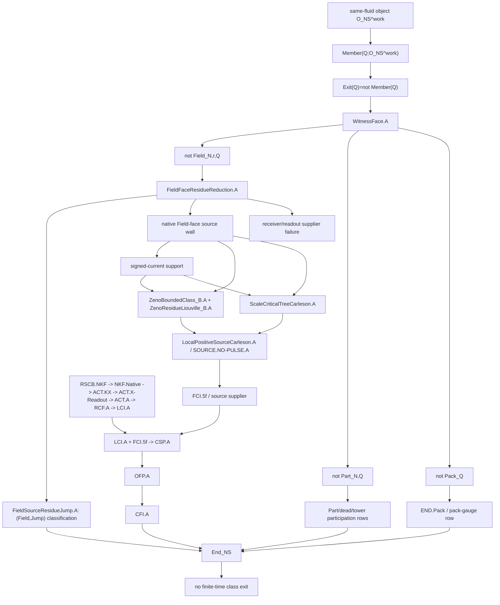

# God's-Eye CM Convergence Atlas

Date: 2026-05-06

Status: audit-open target-refinement atlas; not a theorem discharge or
promotion surface.

Post-audit correction: `FirstHeightCreationDichotomy.A` was later pursued to a
terminal direct attempt and collapsed as an independent target. The atlas now
reads the direct donor-height route as requiring `HeightFluxControl.A` plus a
real structural mechanism.

Scope:

```text
problems/navier-stokes/**
```

Purpose: consolidate the Navier-Stokes lane around the current class-membership
contrapositive route, prevent stale branch promotion, and give the automation
loop a stronger audit-open node-connection surface for future theorem-cranking.

## 1. Governing primitive

The lane primitive is not source-pulse exclusion, averaged terminal-tail
production, a signed-current theorem, or a positive smoothness bootstrap.

It is:

```text
Exit(Q; O_NS^work) := not Member(Q; O_NS^work).
```

The route-relative certificate is:

```text
CM_{N,r,Q} = Pack_Q and Part_{N,Q} and Field_{N,r,Q}.
```

Installed direction:

```text
CM => Member.
```

Installed contrapositive witness use:

```text
first finite class exit / NonSmooth(Q)
=> first witness-face failure
=> not Pack_Q or not Part_{N,Q} or not Field_{N,r,Q}.
```

Not installed:

```text
arbitrary not CM_{N,r,Q} => not Member(Q; O_NS^work).
```

So every branch must answer one of two questions:

```text
Which CM face does this branch serve?
Which licensed bridge moves it into Pack, Part, or Field witness face, class-membership direction, or endpoint?
```

If it answers neither, it is context, not proof spine.

## 2. Master layer map



The graph is meant to police direction.  The source wall is deep, but it is
deep inside the Field face.  It is not the primitive object.

## 3. Three non-negotiable gates

### Gate A: bridge-license gate

Any imported theorem must declare:

```text
source object
target CM face or endpoint row
carrier transfer
scale transfer
proof direction
noncircularity boundary
```

Otherwise it cannot be promoted beyond support.

### Gate B: endpoint-spend gate

Endpoint rows are consumers after class membership, not upstream suppliers.

```text
END.Pack spends pack gauge.
END.Field spends Field + OFP.A.
END.TowerBound spends pointwise DTC.A plus pressure/viscous K_k readout.
END.Cross is endpoint grammar.
END.Exh is endpoint grammar.
```

Forbidden upstream spends:

```text
END.Field cannot prove Field.
READ.COVER cannot prove AVG.MAIN.A or End_NS_avg.
Field.Read cannot prove Field_avg.
DTC.Read cannot prove DTC.A_avg.
FieldSourceResidueJump.A cannot by itself exclude Jump.
```

### Gate C: source-wall Field-face gate

Source-wall estimates may be consumed only after the CM witness split selects
the Field face, or after another face is bridged into the Field row.

The lawful entry is:

```text
not Field
=> VisibleJump_Field
   or not ReceiverFieldSupplier
   or not ReadCover/NoJumpSupplier
   or not NativePositiveSourceControl.A
   or ZenoResidue_B.
```

After non-source alternatives are routed, the live analytic source-wall root is:

```text
ScaleCriticalTreeCarleson.A
or
ZenoBoundedClass_B.A + ZenoResidueLiouville_B.A.
```

## 4. Source-wall alias collapse

The following are not tracked as independent lower roots unless a new proof note
installs a genuinely independent theorem.

```text
LocalPositiveSourceCarleson.A
SOURCE.NO-PULSE.A
SourcePulseExclusion.A
```

all collapse to the operational positive source estimate on selected terminal
packets.

```text
ScaleCriticalTreeCarleson.A
ActiveSquareCarleson.A
SourcePulseExclusion.A
```

all require control of the tree/source-pulse carrier after edge disintegration.

```text
ActiveSquareResidualTail.A
ActiveShellAmplitudeGain.A
SquareSource^{norm}.A
SignedLocalSource.A
```

all present the same active pulse / square-density obstruction.

```text
ParabolicNoFreeSink.A
TerminalSignedSaturation.A
SignedPositiveBalance.A
```

all present the same missing signed counter-edge / no-free-sink law.

```text
CriticalFluxAmplitudeSmall.A
ParabolicEdgeResistance.A
TerminalAmplitudeGain.A
```

all return to scale-critical amplitude/source reserve unless an independent
amplitude theorem is installed.

## 5. Actual next theorem atoms

The highest-value live theorem atoms are:

```text
ReserveCreationCharge.A
```

Prove first-time creation of the donor square reserve is charged by legal
heat/source history.  This is the clean direct route because:

```text
ReserveCreationCharge.A
=> SquareReserveEvolution.A
=> ScaleCriticalTreeCarleson.A
=> LocalPositiveSourceCarleson.A.
```

```text
ActiveWindowHeight.A
DonorReserveAdjointTrace.A
```

These are concrete realizations of ReserveCreationCharge.A, not new headlines.

```text
DonorHeightCreation.A
```

This is now the sharpened direct subatom: first-time square-reserve creation
forces large normalized donor height
`H_N(t)=sup_{k>N}2^k sum_{\ell>k+4}D_\ell(t)`, but it does not by itself prove
first creation of that height. A native height-creation charge theorem closes
the first-pulse reserve branch only together with a real structural
`HeightFluxControl.A` mechanism.

```text
HeightFluxControl.A
```

This is the shell-balance obstruction beneath DonorHeightCreation.A.  The
height derivative is easy; the hard term is the positive weighted shell flux
`sup_k [2^k sum_{\ell>k+4}2^{2\ell}F_\ell]_+`.  Scalar damping does not control
it.

```text
TemporalNonAtomicSource.A
```

Prove the Zeno source-residue measure cannot charge the terminal time slice.
This is the clean alternate route because it upgrades the current compactness
class from a weak bounded class to the time-rigid class needed for Liouville.

```text
WeightedLiftedSkewDefectLegal.A
```

Only worth pursuing through a new cancellation/geometry theorem such as:

```text
TangentWeightRigidity.A + ActiveStrainAlignmentCost.A.
```

Spending critical flux amplitude here is circular because it returns to the
same source wall.

## 6. Direction ledger

| Object | Role | May feed | Must not feed |
| --- | --- | --- | --- |
| `RSCB.NKF -> NKF.Native -> ACT.KX` | retained receiver supplier | `ACT.X-Readout`, `ACT.A`, `RCF.A`, `LCI.A` | endpoint rows, `READ.COVER`, `Field.Read` |
| `LCI.A + FCI.5f` | one-field supplier interface | `CSP.A`, `OFP.A`, `CFI.A` | source-wall proof root by itself |
| `FFSRC.A => FCI.5f` | strengthened source supplier | post-`LCI.A` source integrability | primitive CM bridge |
| `FieldFaceResidueReduction.A` | route typing | legalizes source wall after `not Field` | source-wall discharge |
| `FieldSourceResidueJump.A` | endpoint classification | `(Field,Jump)` cell | endpoint contradiction without `END.Field` |
| `GoodScaleNonCollapse.A` | upstream cover-production target | `UniformReadCover.A`, then downstream readout | source-wall closure unless proved through STC/Zeno |
| `READ.COVER_downstream` | terminal readout interface | `Field.Read`, `DTC.Read`, `READ.END` after averaged endpoint | `AACT.KX`, `AVG.RCV.A`, `LCI.A_avg`, `End_NS_avg` |
| `DTC.A_avg` | averaged tower/receiver datum | averaged endpoint and later pointwise readout after bridge | pointwise `DTC.A` without `DTC.Read` |
| `END.Field` | endpoint row | excludes Jump after `Field+OFP.A` | proving `Field` or `OFP.A` |
| `END.TowerBound` | endpoint row | excludes tower-blown after pointwise tower readout | averaged tower without `DTC.Read` |

## 7. Generated-surface quarantine rules

Any generated, MCP, submission, export, or backlog surface must be demoted or
annotated if it claims any of the following while the source wall remains open:

```text
bridge_pending_count: 0
export-ready
paper-grade global smoothness
OriginalSmoothData => Member => Smooth
PCTP.hard closed as primitive CM bridge
SOURCE.NO-PULSE.A closed without STC/Zeno or licensed equivalent
READ.COVER used upstream
Field source residue used as endpoint contradiction without END.Field
```

The current safe posture is:

```text
coherent theorem program
CM route aligned
source-wall root open
new synthesis atoms audit-open
not publication-complete
```

## 8. Theorem-crank operating method

Each automation or subagent pass is required to produce one of four artifacts:

```text
1. theorem attempt
2. route-typing note
3. audit/demotion note
4. surface synchronization patch
```

The loop is:

```text
intake candidate
-> classify role: primitive / face supplier / source root / readout / endpoint / export
-> run bridge-license gate
-> run direction gate
-> run alias-collapse gate
-> attempt one bounded theorem atom
-> record installed part and exact failed atom
-> synchronize live surfaces
```

The pipeline never stops at "next move" when the next move is
machine-actionable.  It either writes the theorem attempt, demotes the false
promotion, or updates the exact open atom.

## 9. Subagent work allocation

For future wide passes, use five bounded roles:

```text
CM Core Agent
```

Audits Member/CM/Pack/Part/Field direction and catches false converses.

```text
Source Wall Agent
```

Collapses aliases and attacks `DonorHeightCreation.A` /
`ReserveCreationCharge.A`,
`TemporalNonAtomicSource.A`, or `WeightedLiftedSkewDefectLegal.A`.

```text
Receiver/Endpoint Agent
```

Audits `ACT.KX`, `LCI.A`, `CSP.A`, `OFP.A`, `CFI.A`, `READ.COVER`,
`END.Field`, and `DTC.Read` for upstream/downstream circularity.

```text
Corpus Recovery Agent
```

Searches original corpus/imported notes for already-existing proof atoms, but
must attach each recovery to a CM face or support role.

```text
Skeptic Agent
```

Looks only for illegal carrier change, endpoint spending, stale generated
promotion, or alias proliferation.

## 10. Master conclusion

The repo is now best understood as a class-exit atlas, not a pile of rival
regularity proofs.

```text
The survivor is Member/CM.
The faces are Pack, Part, Field.
The source wall is a Field-face residual theorem.
The receiver chain is a Field-preservation supplier.
The endpoint matrix is a terminal consumer.
The signed-current/Zeno/Carleson programs are alternative coordinates on the
same unresolved Field-face source wall unless one installs an independent lower
theorem.
```

This is not closure.  It is the stronger brain surface needed to make future
closure attempts stop wandering.
