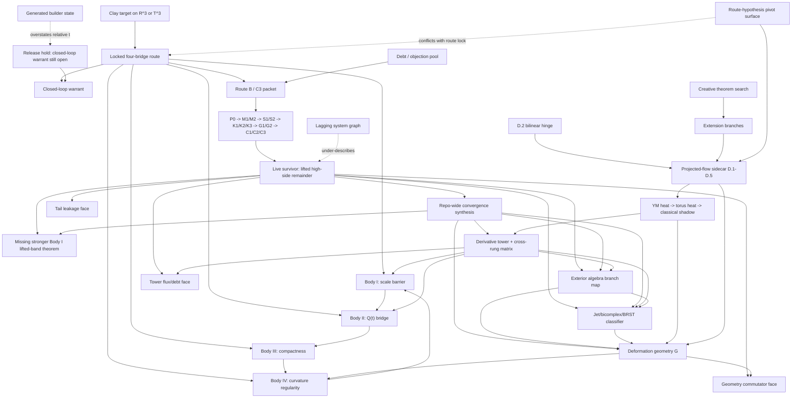

# Navier-Stokes Exploration Graph

## Purpose

This is the wide NS thinking graph.
Its machine-readable companion is
[exploration-graph.yaml](/Users/thomasbirnie/Documents/Research-Consolidation/problems/navier-stokes/exploration-graph.yaml).

Unlike the authority projection in
[layered-route-graph.yaml](/Users/thomasbirnie/Documents/Research-Consolidation/problems/navier-stokes/layered-route-graph.yaml),
this surface keeps the whole local universe visible at once:

- theorem authority,
- theorem-primary route,
- live survivor,
- modernization overlays,
- sidecar routes,
- speculative branches,
- stale but still influential generated surfaces.

This graph is not here so the user has one more thing to browse.
It is here so the model can think with the whole local universe in view.

For the concrete structural changes still required to make this function as a
true graph-first cognition layer, see
[graph-first-structural-upgrade-spec.md](/Users/thomasbirnie/Documents/Research-Consolidation/problems/navier-stokes/theorem-construction/graph-first-structural-upgrade-spec.md).

## Operator contract

The intended behavioral effect is:

- the model should behave **graph-first**, not file-first;
- the model should hold the live frontier, its neighboring branches, and the
  authority route in view at the same time;
- exploratory user input should be treated as raw material to be refined into
  sharper theorem objects, not as noise to be summarized back;
- the model should actively search for:
  - same-burden reformulations,
  - hidden analogies,
  - duplicated branches,
  - stronger common abstractions,
  - route upgrades that preserve theorem truth;
- the model should communicate back in synthesized theorem language, not as a
  tour of nearby notes.

So the intended UX is:

```text
user throws exploratory paint;
model keeps the whole graph in view;
model refines, unifies, sharpens, and returns the strongest truth-bearing picture.
```

The graph exists to increase:

- mathematical awareness,
- connection-finding,
- route memory,
- analogical reach,
- synthesis quality,
- groundedness in what is already proved versus what is only exploratory.

## Core reading

The graph says:

1. the theorem authority root is still the locked four-bridge route;
2. the theorem-primary current implementation is still Route `B / C3`;
3. the actual leading edge is the lifted survivor on
   \[
   N+M<k<j-4;
   \]
4. that survivor is now readable through three synchronized faces:
   - tail leakage,
   - tower flux/debt,
   - deformation-geometry commutator;
5. the tower and deformation-geometry notes are the strongest upgrade surfaces;
6. the jet/bicomplex/BRST note is best read as a cohomological classifier
   candidate for the survivor dictionary, not as a replacement route;
7. the exterior-algebra extraction note sharpens that classifier family into
   five serious subbranches:
   - exactness / alternating-channel language,
   - metric-form versus deformation split,
   - rank / decomposability tests,
   - exact-sequence / filtration structure,
   - shuffle / Hopf reinterpretation of the tower;
8. the projected-flow `D.1-D.5` route is real support, but still sidecar;
9. the whole-lane convergence read is now collected in
   [repo-wide-ns-idea-consolidation-and-proof-convergence.md](/Users/thomasbirnie/Documents/Research-Consolidation/problems/navier-stokes/theorem-construction/repo-wide-ns-idea-consolidation-and-proof-convergence.md);
10. the cleanest current endgame writeup from the wiki-driven branch is now
   collected in
   [tower-to-shuffle-to-deformation-endgame-program.md](/Users/thomasbirnie/Documents/Research-Consolidation/problems/navier-stokes/theorem-construction/tower-to-shuffle-to-deformation-endgame-program.md);
11. speculative and generated surfaces should remain visible for thinking without
   silently becoming theorem truth.

## Graph



## How to use it

- For theorem truth, start from
  [layered-route-graph.yaml](/Users/thomasbirnie/Documents/Research-Consolidation/problems/navier-stokes/layered-route-graph.yaml).
- For exploration and connection-building, start from
  [exploration-graph.yaml](/Users/thomasbirnie/Documents/Research-Consolidation/problems/navier-stokes/exploration-graph.yaml).

The important rule is:

```text
authority projection is a downstream cut of the exploration graph.
It is not a replacement for it.
```

And when the question is specifically:

```text
is this packet exact, filtered, simple, or shuffle-composite?
```

the right local entrypoint is
[exterior-algebra-extraction-for-ns-route.md](/Users/thomasbirnie/Documents/Research-Consolidation/problems/navier-stokes/theorem-construction/exterior-algebra-extraction-for-ns-route.md),
not the authority cut.
