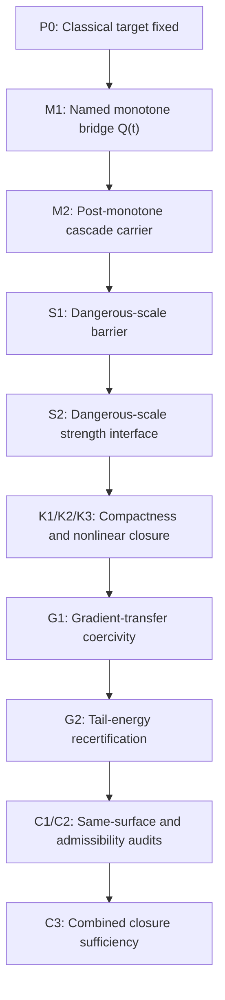
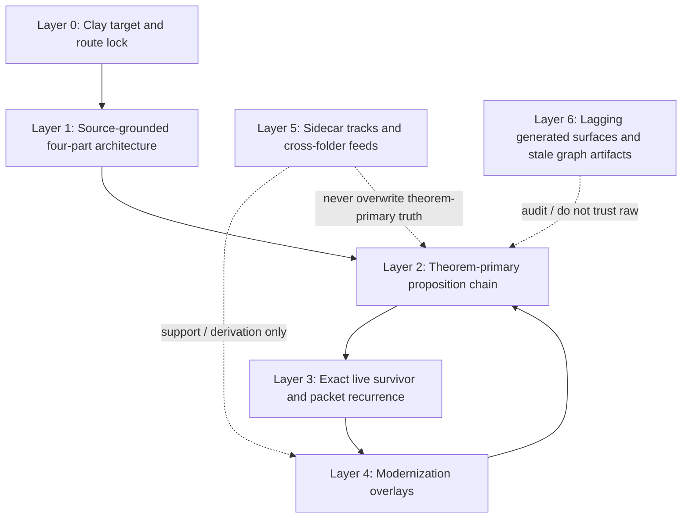

# Navier-Stokes Layered Route Graph

## Purpose

This note is a folder-wide route map for the Navier-Stokes lane.
Its machine-readable companion is
[layered-route-graph.yaml](/Users/thomasbirnie/Documents/Research-Consolidation/problems/navier-stokes/layered-route-graph.yaml).

Its job is to stop the lane from being read as one flat pile of notes.
It separates:

1. theorem target and route lock,
2. release and review truth,
3. source-faithful legacy architecture,
4. theorem-primary current route,
5. the exact live obstruction,
6. modernization overlays,
7. cross-folder sidecars and support feeds,
8. stale or lagging generated surfaces.

If two layers disagree, the higher-authority layer wins.

## Precedence rule

Use the folder in this order:

1. **Theorem target / route lock**
2. **Release and review truth**
3. **Source-grounded architecture**
4. **Theorem-primary current route**
5. **Exact live survivor and packet recurrence**
6. **Modernization overlays**
7. **Cross-folder sidecars and synthesis feeds**
8. **Generated state surfaces and stale graph artifacts**

The main discipline is:

```text
do not let a lower layer silently overwrite a higher one.
```

## Two graph roles

The lane needs two different graph objects.

### Exploration graph

This is the wide thinking surface.

It contains:

- the source-grounded four-body route,
- the theorem-primary current route,
- the exact live survivor,
- all serious modernization attempts,
- all sidecar theorem tracks,
- objections, audits, dead ends, and reformulations,
- quarantined but still serious speculative branches,
- cross-folder feeds that materially shaped the lane.

Its job is:

- preserve the whole local NS universe,
- keep parallel ideas visible at once,
- expose connections and contradictions,
- help route synthesis and new theorem insight.

Canonical surfaces:

- [ns-exploration-graph.md](/Users/thomasbirnie/Documents/Research-Consolidation/problems/navier-stokes/theorem-construction/ns-exploration-graph.md)
- [exploration-graph.yaml](/Users/thomasbirnie/Documents/Research-Consolidation/problems/navier-stokes/exploration-graph.yaml)
- [repo-wide-ns-idea-consolidation-and-proof-convergence.md](/Users/thomasbirnie/Documents/Research-Consolidation/problems/navier-stokes/theorem-construction/repo-wide-ns-idea-consolidation-and-proof-convergence.md)

### Authority projection

This is the narrow theorem-truth surface.

It contains only:

- the fixed theorem target,
- the route lock,
- the release/review truth,
- the source-grounded architecture,
- the currently endorsed theorem-primary route,
- the exact live survivor on that route.

Its job is:

- determine what currently counts,
- keep papers and theorem claims honest,
- prevent sidecars and synthesis feeds from silently replacing the route.

So the correct relationship is:

```math
\boxed{
\text{authority projection} \subset \text{exploration graph}.
}
```

The authority projection is a downstream cut of the exploration graph,
not a replacement for it.

## Layer 0. Theorem target and route lock

This is the top constraint.

The official theorem target is the classical incompressible Navier-Stokes
problem in dimension `3` on an accepted Clay surface:

```math
M^3 \in \{\mathbb R^3,\mathbb T^3\}.
```

The current route-lock surfaces still record the theorem-primary branch as the
whole-space classical route:

- [route-lock.yaml](/Users/thomasbirnie/Documents/Research-Consolidation/problems/navier-stokes/route-lock.yaml)
- [proof-assembly.yaml](/Users/thomasbirnie/Documents/Research-Consolidation/problems/navier-stokes/proof-assembly.yaml)
- [main-theorem-draft.md](/Users/thomasbirnie/Documents/Research-Consolidation/problems/navier-stokes/theorem-construction/main-theorem-draft.md)
- [theorem-to-warrant.yaml](/Users/thomasbirnie/Documents/Research-Consolidation/problems/navier-stokes/theorem-to-warrant.yaml)
- [theorem-packet.yaml](/Users/thomasbirnie/Documents/Research-Consolidation/problems/navier-stokes/theorem-packet.yaml)

So the correct reading is:

- `R^3` is **not** mandatory at the Clay-target level;
- the route lock still names the primary route as the classical Euclidean
  four-bridge branch;
- any torus argument only counts if it is either
  - the chosen classical theorem branch, or
  - a derivation/proving surface that descends back to the chosen classical
    theorem surface with no hidden stronger structure.

## Layer 0A. Release and review truth

This sits one level below the route lock.

Primary surfaces:

- [formalization-ledger.md](/Users/thomasbirnie/Documents/Research-Consolidation/problems/navier-stokes/formalization-ledger.md)
- [release-decision.yaml](/Users/thomasbirnie/Documents/Research-Consolidation/problems/navier-stokes/release-decision.yaml)
- [review-verdict.yaml](/Users/thomasbirnie/Documents/Research-Consolidation/problems/navier-stokes/review-verdict.yaml)

These surfaces currently say:

- the direct Euclidean Route `B / C3` package remains the authoritative route on
  the declared classical surface;
- the lane is **not** solved internally;
- the package is on hold because the closed-loop warrant is not discharged on
  the declared theorem surface.

So if a generated builder says "closed" while these surfaces say "hold" or
"conditional-route-closure", the release/review layer wins.

## Layer 1. Source-grounded architecture

This is the original four-part framework and remains the first theorem
authority inside the lane.

Primary surfaces:

- [source-grounded-framework-map.md](/Users/thomasbirnie/Documents/Research-Consolidation/problems/navier-stokes/source-grounded-framework-map.md)
- [spine.md](/Users/thomasbirnie/Documents/Research-Consolidation/problems/navier-stokes/spine.md)
- [claim-ladder.md](/Users/thomasbirnie/Documents/Research-Consolidation/problems/navier-stokes/claim-ladder.md)
- [route-lock.yaml](/Users/thomasbirnie/Documents/Research-Consolidation/problems/navier-stokes/route-lock.yaml)

The source-grounded four-part architecture is:

```math
\text{Scale Barrier}
\to
\text{Monotone Functional}
\to
\text{Non-Sobolev Compactness}
\to
\text{Gradient / Curvature Bridge}
\to
\text{Scale Barrier}.
```

In the lane's own exact source language this is:

1. `Scale-Barrier Principle`
2. `Monotone Functional`
3. `Non-Sobolev Compactness`
4. `Curvature-Based Regularity`

This layer fixes the classical body jobs.
It leaves the modern coordinate system undecided; any later surface that uses
modern coordinates must state that coordinate system and prove the descent back
to the classical theorem surface before it can carry proof force.

## Layer 2. Theorem-primary current route

This is the current theorem-construction package that turns the legacy
architecture into an explicit proposition chain.

Primary surfaces:

- [main-theorem-draft.md](/Users/thomasbirnie/Documents/Research-Consolidation/problems/navier-stokes/theorem-construction/main-theorem-draft.md)
- [spine.md](/Users/thomasbirnie/Documents/Research-Consolidation/problems/navier-stokes/spine.md)
- [claim-ladder.md](/Users/thomasbirnie/Documents/Research-Consolidation/problems/navier-stokes/claim-ladder.md)
- [proof-assembly.yaml](/Users/thomasbirnie/Documents/Research-Consolidation/problems/navier-stokes/proof-assembly.yaml)
- [formalization-ledger.md](/Users/thomasbirnie/Documents/Research-Consolidation/problems/navier-stokes/formalization-ledger.md)

Its explicit package graph is:



This is still the theorem-primary route.

The most important current fact here is:

- the source-faithful four jobs still exist,
- but the live burden has been pushed deeper than the older prose suggested,
- and the theorem-primary closure still depends on the `3 -> 4 -> 1` return.

## Layer 3. Exact live survivor and packet recurrence

This is the actual leading edge of the lane right now.

Primary surfaces:

- [defect-reduction-tower-and-four-body-recurrence-note.md](/Users/thomasbirnie/Documents/Research-Consolidation/problems/navier-stokes/theorem-construction/defect-reduction-tower-and-four-body-recurrence-note.md)
- [modernized-four-body-schema-torus-tower-geometry.md](/Users/thomasbirnie/Documents/Research-Consolidation/problems/navier-stokes/theorem-construction/modernized-four-body-schema-torus-tower-geometry.md)
- [route-b-euclidean-closure-theorem.md](/Users/thomasbirnie/Documents/Research-Consolidation/problems/navier-stokes/theorem-construction/route-b-euclidean-closure-theorem.md)
- [lifted-remainder-feedback-into-body1-audit.md](/Users/thomasbirnie/Documents/Research-Consolidation/problems/navier-stokes/theorem-construction/lifted-remainder-feedback-into-body1-audit.md)

The old four-body program was not merely four isolated themes.
It was a literal propagated packet with a live survivor.

The modernized packet is therefore read in this graph as:

```math
\bigl(\mathcal P_{\mathrm{mod}}(T),\mathcal E_{\mathrm{live}}^{(n)}\bigr)
\Longrightarrow
\bigl(\mathcal P_{\mathrm{mod}}(T^+),\mathcal E_{\mathrm{live}}^{(n+1)}\bigr).
```

The exact current survivor is still the lifted high-side remainder on the shell
geometry

```math
N+M<k<j-4.
```

The open target is still of the form

```math
|\mathcal N^{\mathrm{lift}}_{N,\mathrm{grad}}(t)|
\le
\varepsilon \nu D_N(t) + C_*2^{-2\delta N},
```

and this has **not** been discharged.

The crucial leading-edge insight is that the same survivor is now tracked
through three synchronized faces:

1. **Body I face**: unresolved tail leakage / no-escape failure,
2. **Body II face**: unresolved tower flux/debt packet,
3. **Body IV face**: unresolved deformation-geometry commutator packet.

That is the present leading edge of the theory.

## Layer 4. Modernization overlays

These are the newer languages that sharpen the route.
They are **not** automatic replacements for the theorem-primary packet.

### Layer 4A. Tower and cross-rung language

Primary surfaces:

- [tower-rewrite-under-ym-heat-shadow-bridge.md](/Users/thomasbirnie/Documents/Research-Consolidation/problems/navier-stokes/theorem-construction/tower-rewrite-under-ym-heat-shadow-bridge.md)
- [cross-rung-matrix-under-ym-heat-shadow-bridge.md](/Users/thomasbirnie/Documents/Research-Consolidation/problems/navier-stokes/theorem-construction/cross-rung-matrix-under-ym-heat-shadow-bridge.md)
- [mixed-jet-cross-rung-pairing-matrix.md](/Users/thomasbirnie/Documents/Research-Consolidation/problems/navier-stokes/theorem-construction/mixed-jet-cross-rung-pairing-matrix.md)

This layer says:

- the derivative tower is the primary visible bookkeeping surface;
- viscosity has a one-derivative advantage over each mixed source term;
- the real contest is that derivative advantage versus lower-rung coefficient
  growth;
- the off-diagonal matrix law is as important as the diagonal rung energies.

This layer now handles most of Bodies I and II conceptually.

### Layer 4B. Deformation-geometry and geometry-evolving heat

Primary surfaces:

- [spatial-derivative-curvature-dissipation-theorem-target.md](/Users/thomasbirnie/Documents/Research-Consolidation/problems/navier-stokes/theorem-construction/spatial-derivative-curvature-dissipation-theorem-target.md)
- [modernized-four-body-schema-torus-tower-geometry.md](/Users/thomasbirnie/Documents/Research-Consolidation/problems/navier-stokes/theorem-construction/modernized-four-body-schema-torus-tower-geometry.md)

This layer changes the search surface for the real drain law.

Instead of trying to force a pure quadratic Eulerian tower functional to behave
like Yang-Mills heat, it pushes the primary target to Lagrangian deformation
geometry:

```math
\partial_t v + A^\top \nabla_a q
=
\nu\,\operatorname{div}_a(G\nabla_a v),
\qquad
G=AA^\top.
```

The key claim here is:

```text
this layer reads NS as geometry-evolving heat,
with the Eulerian derivative tower treated as its visible shadow.
```

This is the strongest current candidate for upgrading Body IV.

### Layer 4C. YM heat / torus / classical shadow bridge

Primary surfaces:

- [ym-heat-to-torus-heat-to-classical-shadow-bridge.md](/Users/thomasbirnie/Documents/Research-Consolidation/problems/navier-stokes/theorem-construction/ym-heat-to-torus-heat-to-classical-shadow-bridge.md)
- [projected-nc-flow-clay-frontier.md](/Users/thomasbirnie/Documents/Research-Consolidation/problems/navier-stokes/projected-nc-flow-clay-frontier.md)

This layer contributes the heat-language synthesis:

```math
\text{YM heat on carrier}
\to
\text{torus spectral heat realization}
\to
\text{classical viscous shadow}.
```

This does **not** yet close the theorem.
Its honest current role is:

- explain why torus spectral coercivity and classical viscosity are read here
  as candidate faces of one deeper heat law,
- motivate the deformation-geometry route,
- but remain subordinate to the same-surface classical theorem discipline.

## Layer 5. Cross-folder sidecars and support feeds

These are real connections, but they are not all theorem authority.

### Layer 5A. NS sidecar theorem track

Primary surfaces:

- [projected-nc-flow-clay-frontier.md](/Users/thomasbirnie/Documents/Research-Consolidation/problems/navier-stokes/projected-nc-flow-clay-frontier.md)
- [theorem-to-warrant.yaml](/Users/thomasbirnie/Documents/Research-Consolidation/problems/navier-stokes/theorem-to-warrant.yaml)
- [d1-projected-nc-flow-well-posedness.md](/Users/thomasbirnie/Documents/Research-Consolidation/problems/navier-stokes/theorem-construction/d1-projected-nc-flow-well-posedness.md)
- [d3-commutative-shadow-theorem.md](/Users/thomasbirnie/Documents/Research-Consolidation/problems/navier-stokes/theorem-construction/d3-commutative-shadow-theorem.md)
- [d4-shadow-continuation-theorem.md](/Users/thomasbirnie/Documents/Research-Consolidation/problems/navier-stokes/theorem-construction/d4-shadow-continuation-theorem.md)

This is a real NS-only auxiliary theorem track.
It is **not** the source-grounded primary route.

Its correct role is:

- sidecar theorem track,
- proving ground for projected-flow / shadow descent ideas,
- possible contributor to modernization,
- not allowed to silently replace the source-grounded classical packet.

### Layer 5B. Cross-folder synthesis feeds

Materially connected external surfaces include:

- [working-notes/ontic-nc-ns-ymg-hodge-program.md](/Users/thomasbirnie/Documents/Research-Consolidation/working-notes/ontic-nc-ns-ymg-hodge-program.md)
- [working-notes/ontic-flow-closure-proof-spine.md](/Users/thomasbirnie/Documents/Research-Consolidation/working-notes/ontic-flow-closure-proof-spine.md)
- [working-notes/ns-clay-frontier-proof-pack.md](/Users/thomasbirnie/Documents/Research-Consolidation/working-notes/ns-clay-frontier-proof-pack.md)
- [working-notes/refinement-commutator-estimate-and-scale-gap.md](/Users/thomasbirnie/Documents/Research-Consolidation/working-notes/refinement-commutator-estimate-and-scale-gap.md)
- [working-notes/projected-defect-growth-and-carrier-reduction.md](/Users/thomasbirnie/Documents/Research-Consolidation/working-notes/projected-defect-growth-and-carrier-reduction.md)
- [upstream-synthesis-feed.yaml](/Users/thomasbirnie/Desktop/ToE/ToE/monograph-V6/problems/yang-mills-gap/upstream-synthesis-feed.yaml)

These surfaces matter because they carried the tower, carrier, commutator,
YM-heat, and projected-flow upgrades into the lane.

But their correct status is:

- **support / derivation / synthesis feed** unless a lane-local theorem surface
  promotes the content into NS theorem authority,
- **never** allowed to override Layer 0 through Layer 3 on their own.

## Layer 5A. Exploration-only branch surfaces

These belong in the exploration graph even when they are not theorem authority.

Primary surfaces:

- [extension-branches.yaml](/Users/thomasbirnie/Documents/Research-Consolidation/problems/navier-stokes/extension-branches.yaml)
- [creative-theorem-search.yaml](/Users/thomasbirnie/Documents/Research-Consolidation/problems/navier-stokes/creative-theorem-search.yaml)
- [debt-map.yaml](/Users/thomasbirnie/Documents/Research-Consolidation/problems/navier-stokes/debt-map.yaml)
- [route-hypothesis.yaml](/Users/thomasbirnie/Documents/Research-Consolidation/problems/navier-stokes/route-hypothesis.yaml)
- [obstruction-capture.md](/Users/thomasbirnie/Documents/Research-Consolidation/problems/navier-stokes/obstruction-capture.md)

These surfaces are where the broad exploratory universe actually leaks through:

- speculative object-definition branches,
- sidecar frontier burdens,
- creative bounded variants,
- route pivots,
- blocker captures and route-local objections.

They remain visible in the exploration graph as thinking material, while
theorem authority is still restricted to same-surface theorem-grade promotions.

## Layer 6. Lagging or stale surfaces

These surfaces are useful, but they currently leak stale or mixed route truth
back into the lane if read naively.

### 6A. Generated lane surfaces with mixed state

- [proof-assembly.yaml](/Users/thomasbirnie/Documents/Research-Consolidation/problems/navier-stokes/proof-assembly.yaml)
- [source-frontier.yaml](/Users/thomasbirnie/Documents/Research-Consolidation/problems/navier-stokes/source-frontier.yaml)
- [theorem-packet.yaml](/Users/thomasbirnie/Documents/Research-Consolidation/problems/navier-stokes/theorem-packet.yaml)

Current issue:

- they still elevate machine-extension / ontic / projected-route burdens into
  the apparent grounded frontier;
- one builder now even reports the package as `closed` while the release stack
  still records `hold` and `conditional-route-closure`;
- this conflicts with the stronger lane rule in
  [spine.md](/Users/thomasbirnie/Documents/Research-Consolidation/problems/navier-stokes/spine.md)
  and
  [claim-ladder.md](/Users/thomasbirnie/Documents/Research-Consolidation/problems/navier-stokes/claim-ladder.md),
  where those sidecars are supposed to remain archived provenance unless
  explicitly promoted.

### 6B. Route lock surface with stale bridge language

- [theorem-to-warrant.yaml](/Users/thomasbirnie/Documents/Research-Consolidation/problems/navier-stokes/theorem-to-warrant.yaml)

Current issue:

- it still hard-locks the theorem surface as `classical-euclidean-navier-stokes`
  and states the gradient bridge as already discharged in a way that no longer
  matches the sharper modernized obstruction analysis;
- this makes it a useful historical route-lock surface, but not a safe single
  source of live frontier truth.

### 6C. External theorem-authority graph lag

- [graph-impacts/navier-stokes.yaml](/Users/thomasbirnie/Documents/Research-Consolidation/system/meta/collaboration/graph-impacts/navier-stokes.yaml)

Current issue:

- it still carries stale nodes such as `curvature_based_regularity_body` and
  other older abstractions;
- that graph is supposed to be dependency memory, not theorem judgment;
- for NS right now it is lagging behind the live route.

## Full layered graph



## Folder-wide judgment

Read the whole NS folder with this discipline:

1. **The source-grounded four-part architecture is still the theorem contract.**
2. **The release/review stack outranks optimistic generated builder output.**
3. **The theorem-primary current route is still the explicit proposition chain
   in the main theorem draft.**
4. **The actual leading edge is the live survivor family, not the body labels.**
5. **The tower and deformation-geometry notes are the strongest new math
   surfaces.**
6. **The projected-flow / torus / YM material is a real support route, but still
   a sidecar unless promoted same-surface and theorem-grade.**
7. **Exploration branches remain visible as thinking material even when they
   are not theorem authority.**
8. **Generated frontier and graph surfaces are currently lagging and must not be
   allowed to overwrite the live theorem reading.**

## What the leading edge actually is

The current best folder-wide statement is:

```math
\boxed{
\text{the live NS frontier is the attempt to identify one same survivor family}
}
```

through three synchronized readouts:

```math
\boxed{
\text{tail leakage}
\leftrightarrow
\text{tower flux/debt}
\leftrightarrow
\text{deformation-geometry commutator}.
}
```

Those three exposed faces are still the correct classical core. But they are
not the whole loop by themselves: Body III remains the physical
compactness/extraction passage that forces that same survivor onto the exact
same-surface object. On the current
torus-first selector route the live `SG.4` wall is the selector-facing face of
that same survivor, and the pair-defect / projective packets refine that face
further into the one-sided defect `[\lambda_J-\mathfrak s_J]_+`, the
directional defect `\Xi_J`, and, on the exact-potential branch, the projector gap
`\frac12\|P_{ab}-P_{J,\top}^{seg}\|_F^2`, with `W_J` serving as the signless
observable carrier rather than the defect itself. See
[four-body-survivor-to-selector-readout-dictionary.md](/Users/thomasbirnie/Workspace/ToE/Research-Consolidation/problems/navier-stokes/theorem-construction/four-body-survivor-to-selector-readout-dictionary.md).

If a future note closes that triangle on one accepted classical theorem
surface, that will be a genuine route upgrade.

Until then, this layered map is the safe way to read the folder without
flattening it.

## Core surfaces by layer

### Authority and route lock

- [route-lock.yaml](/Users/thomasbirnie/Documents/Research-Consolidation/problems/navier-stokes/route-lock.yaml)
- [source-grounded-framework-map.md](/Users/thomasbirnie/Documents/Research-Consolidation/problems/navier-stokes/source-grounded-framework-map.md)
- [spine.md](/Users/thomasbirnie/Documents/Research-Consolidation/problems/navier-stokes/spine.md)
- [claim-ladder.md](/Users/thomasbirnie/Documents/Research-Consolidation/problems/navier-stokes/claim-ladder.md)
- [main-theorem-draft.md](/Users/thomasbirnie/Documents/Research-Consolidation/problems/navier-stokes/theorem-construction/main-theorem-draft.md)

### Release and review truth

- [formalization-ledger.md](/Users/thomasbirnie/Documents/Research-Consolidation/problems/navier-stokes/formalization-ledger.md)
- [release-decision.yaml](/Users/thomasbirnie/Documents/Research-Consolidation/problems/navier-stokes/release-decision.yaml)
- [review-verdict.yaml](/Users/thomasbirnie/Documents/Research-Consolidation/problems/navier-stokes/review-verdict.yaml)

### Live frontier

- [defect-reduction-tower-and-four-body-recurrence-note.md](/Users/thomasbirnie/Documents/Research-Consolidation/problems/navier-stokes/theorem-construction/defect-reduction-tower-and-four-body-recurrence-note.md)
- [route-b-euclidean-closure-theorem.md](/Users/thomasbirnie/Documents/Research-Consolidation/problems/navier-stokes/theorem-construction/route-b-euclidean-closure-theorem.md)
- [modernized-four-body-schema-torus-tower-geometry.md](/Users/thomasbirnie/Documents/Research-Consolidation/problems/navier-stokes/theorem-construction/modernized-four-body-schema-torus-tower-geometry.md)

### Modern overlays

- [tower-rewrite-under-ym-heat-shadow-bridge.md](/Users/thomasbirnie/Documents/Research-Consolidation/problems/navier-stokes/theorem-construction/tower-rewrite-under-ym-heat-shadow-bridge.md)
- [cross-rung-matrix-under-ym-heat-shadow-bridge.md](/Users/thomasbirnie/Documents/Research-Consolidation/problems/navier-stokes/theorem-construction/cross-rung-matrix-under-ym-heat-shadow-bridge.md)
- [spatial-derivative-curvature-dissipation-theorem-target.md](/Users/thomasbirnie/Documents/Research-Consolidation/problems/navier-stokes/theorem-construction/spatial-derivative-curvature-dissipation-theorem-target.md)
- [ym-heat-to-torus-heat-to-classical-shadow-bridge.md](/Users/thomasbirnie/Documents/Research-Consolidation/problems/navier-stokes/theorem-construction/ym-heat-to-torus-heat-to-classical-shadow-bridge.md)

### Sidecars and support feeds

- [projected-nc-flow-clay-frontier.md](/Users/thomasbirnie/Documents/Research-Consolidation/problems/navier-stokes/projected-nc-flow-clay-frontier.md)
- [proof-assembly.yaml](/Users/thomasbirnie/Documents/Research-Consolidation/problems/navier-stokes/proof-assembly.yaml)
- [source-frontier.yaml](/Users/thomasbirnie/Documents/Research-Consolidation/problems/navier-stokes/source-frontier.yaml)
- [theorem-to-warrant.yaml](/Users/thomasbirnie/Documents/Research-Consolidation/problems/navier-stokes/theorem-to-warrant.yaml)
- [theorem-packet.yaml](/Users/thomasbirnie/Documents/Research-Consolidation/problems/navier-stokes/theorem-packet.yaml)

### Exploration-only branch surfaces

- [extension-branches.yaml](/Users/thomasbirnie/Documents/Research-Consolidation/problems/navier-stokes/extension-branches.yaml)
- [creative-theorem-search.yaml](/Users/thomasbirnie/Documents/Research-Consolidation/problems/navier-stokes/creative-theorem-search.yaml)
- [debt-map.yaml](/Users/thomasbirnie/Documents/Research-Consolidation/problems/navier-stokes/debt-map.yaml)
- [route-hypothesis.yaml](/Users/thomasbirnie/Documents/Research-Consolidation/problems/navier-stokes/route-hypothesis.yaml)
- [obstruction-capture.md](/Users/thomasbirnie/Documents/Research-Consolidation/problems/navier-stokes/obstruction-capture.md)
